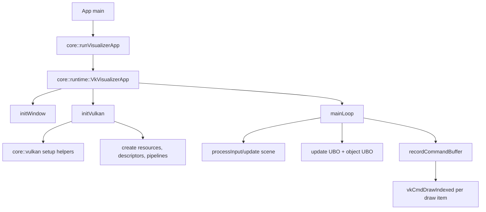

# `src/core` Architecture

## Purpose

`src/core` contains shared runtime and Vulkan scaffolding used by app frontends like `vkraw` and `vkScene`.
Feature-specific logic (for example, globe UI and controls) should stay outside core unless it is reusable.

## Module Boundaries

- `src/core/runtime`
  - Owns app runtime orchestration (`VkVisualizerApp`) and frame loop.
  - Calls into Vulkan setup helpers and scene systems.
  - Manages per-frame updates, descriptor binding, and draw submission.
- `src/core/vulkan`
  - Owns Vulkan setup helpers for swapchain, render pass, framebuffers, and pipeline creation.
  - Should not own app-specific mesh/scene logic.
- `src/core/features`
  - Optional reusable feature modules layered on top of runtime/core types.
  - Current example: `features/globe` control + mesh helpers.
- `src/core` root headers
  - Shared plain data/utility structures:
  - `RenderTypes.h` (`Vertex`, `UniformBufferObject`, `ObjectUniformData`, push constants).
  - `SceneGraph.h`.
  - `EcsWorld.h`.
  - `AppRunner.h` (`--help`, common CLI parsing entry path).

## Runtime Flow

## Ownership Rules

- Core headers must not include `src/vkraw/*` wrappers.
- New reusable systems go into `src/core/*`; app frontends only assemble/configure them.
- Keep scene/object model independent from app branding.
- Descriptor layout and pipeline setup that multiple apps share belong in `src/core/vulkan`.

## Migration Checklist For New Apps

1. Add a new app entry point under `src/<app>/main.cpp`.
2. Call `core::runtime::runVkSceneApp(...)` or `core::runVisualizerApp(...)`.
3. Add executable target in `CMakeLists.txt` reusing `${VKRAW_APP_SOURCES}`.
4. Keep app-specific objects/features under `src/<app>/` or `src/core/features/` if reusable.
5. Avoid new direct dependencies from `src/core/*` to `src/vkraw/*`.
6. If app needs new shared descriptors/pipeline behavior, add it in `src/core/vulkan`.
7. If app needs object material/texture changes, use `vkscene::RenderObject::Material` and core texture slots.
8. Build both `vkraw` and the new app to catch shared-runtime regressions.

## Current Shared Rendering Capabilities

- Scene graph + ECS transform/visibility path.
- Per-object dynamic uniform buffer updates.
- Bindless-style texture array descriptor path with named slots (`earth`, `checker`).
- Per-object pipeline selection by primitive + shader set.
