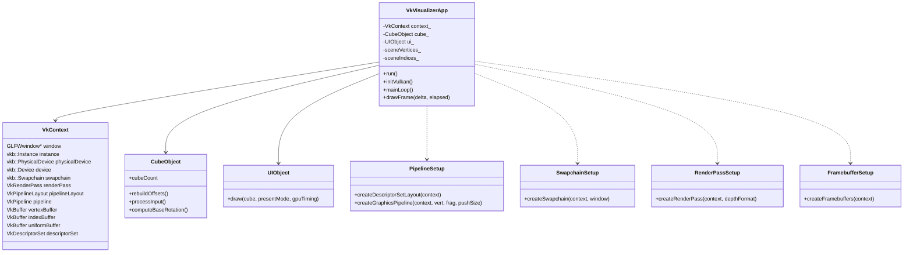
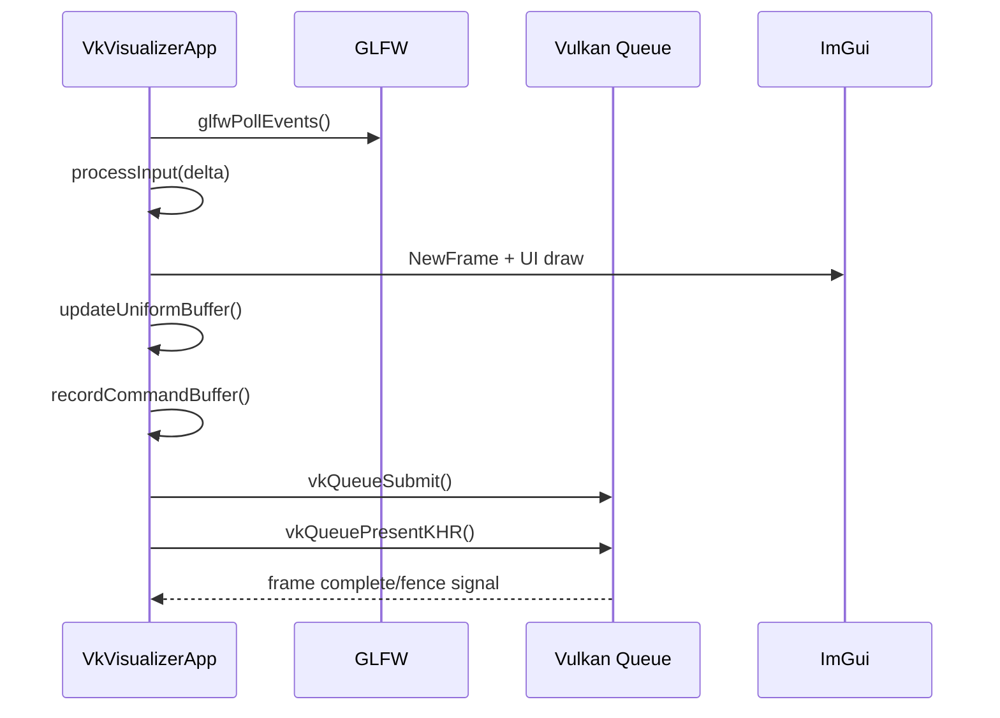
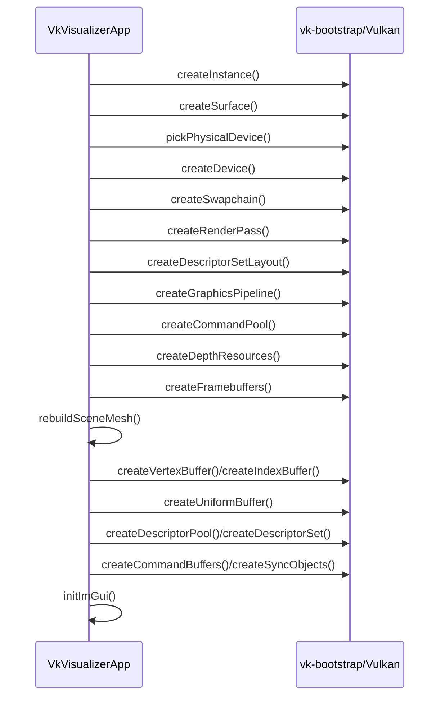
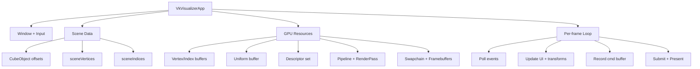

# Scene Management Strategies For `vkraw`

This document summarizes scene-management approaches and algorithms you can use to evolve `vkraw` from a static cube benchmark into a globe-scale streaming world (tiles, roads, buildings, vehicles, overlays). It now includes both a raw Vulkan path (`vkraw`) and a VulkanSceneGraph path (`vkvsg`) so you can choose where to implement each feature first.

## 1. What We Need To Support

Required behaviors:

- Add/remove entities at runtime.
- Show/hide visibility toggles.
- Distance-based level of detail (LOD).
- Billboard/impostor rendering.
- Object replacement by camera distance.
- Earth tile streaming with OSM-derived detail.
- Rendering roads, buildings, water, ground entities, and vehicles.
- Accurate picking (AABB + ray casting minimum).
- External data overlays (oceans, lakes, thematic layers).

These requirements imply two kinds of scale at once: geometric scale (Earth-sized coordinates, huge camera ranges, LOD transitions) and entity scale (many objects, many updates, frequent visibility changes). The architecture has to avoid per-frame full-scene rebuilds while still allowing rich runtime edits.

## 2. Candidate Scene Management Models

## 2.1 Scene Graph

Best when hierarchy and transform inheritance matter.

Typical node layout:

- `Root`
- `Globe`
- `Tiles`
- `RoadLayer`
- `BuildingLayer`
- `VehicleLayer`
- `OverlayLayer`

Pros:

- Natural parent/child transforms.
- Easy culling traversal.
- Good fit for tile trees (quadtree nodes as graph nodes).

Cons:

- Can become pointer-heavy and cache-unfriendly for very large dynamic entity counts.

Use for:

- Globe + tile hierarchy.
- Static or semi-static world layers.

A scene graph gives you a direct way to represent world structure: tiles are children of tile parents, overlays are layer nodes, and view-dependent traversal can reject whole branches quickly. It also naturally supports feature-scoped state (for example, all water nodes under one material state node).

The primary risk is mutation cost and traversal overhead when thousands of highly dynamic objects are inserted/removed every frame. A graph can handle dynamic changes, but pure graph designs tend to degrade when simulation-heavy objects dominate.

## 2.2 ECS (Entity Component System)

Best when many dynamic entities need efficient updates.

Core components:

- `Transform`
- `Renderable`
- `Visibility`
- `LodState`
- `Bounds`
- `Velocity`
- `RoadAgent` / `VehicleAgent`

Pros:

- Scales well with many moving objects.
- Fast batch updates.
- Clean separation: data vs systems.

Cons:

- Harder to represent hierarchical transforms unless explicitly modeled.

Use for:

- Vehicles, dynamic props, simulation-driven objects.

ECS is ideal for objects whose state changes every frame: vehicles, traffic agents, crowds, dynamic markers. With SoA component layout, systems can run cache-friendly loops and multithread efficiently.

The tradeoff is that hierarchy and render-state inheritance are not automatic. You need explicit bridge logic that translates ECS state into render submissions and optional parent-child transform relationships.

## 2.3 Hybrid (Recommended)

Use a scene graph for world/tile hierarchy and ECS for dynamic actors.

- Scene graph owns coarse world structure and render pass grouping.
- ECS owns high-count dynamic entities and per-frame logic.
- Bridge via render extraction step: ECS -> transient draw packets / instance buffers.

This is the most practical path for your goals.

Hybrid architecture lets each subsystem do what it does best: graph for spatial and material structure, ECS for high-frequency simulation and visibility decisions. This avoids forcing one paradigm to solve all problems.

In practice, the render frame builds from two streams: persistent scene graph nodes (terrain, buildings, water layers) and extracted ECS draw lists (vehicles, effects, dynamic overlays). Both streams should end up in common GPU-friendly batches.

## 3. Core Runtime Algorithms

## 3.1 Add / Remove / Show / Hide

Use stable handles with generation counters.

- `EntityId = {index, generation}` to avoid stale references.
- Free-list allocator for fast reuse.
- `Visibility` component with bitmask flags:
  - `Visible`
  - `EditorHidden`
  - `Culled`
  - `DistanceHidden`

Command-buffer pattern for edits:

- Queue structural changes (`Add`, `Remove`, `SetVisible`) during frame.
- Apply at a sync point to avoid mid-frame iterator invalidation.

The critical detail is deterministic mutation timing. Applying structural changes in the middle of update/cull/render loops causes instability and hard-to-debug lifetime bugs. Queue-and-apply phases avoid that.

For scene graph nodes, keep a node registry with indirection handles so gameplay systems do not hold raw pointers. For ECS, generation IDs solve stale references after removal/reuse.

## 3.2 Culling

Broad phase:

- Frustum vs bounding sphere (fast reject).
- Frustum vs AABB for tighter reject.

Spatial index options:

- Loose octree (general 3D worlds).
- BVH (mesh-heavy scenes).
- Quadtree (Earth tiles in lat/lon or projected space).

For globe tiles:

- Tile quadtree + camera frustum + horizon culling.

Culling should be multi-stage: first very cheap tests to reject most objects, then progressively tighter tests. Doing triangle-level work too early wastes CPU/GPU time.

For Earth views, horizon culling matters as much as frustum culling. Large tile sets behind the horizon can pass frustum tests but are still invisible. Combine horizon checks with quadtree traversal to avoid loading/rendering hidden tiles.

## 3.3 LOD Selection

Use screen-space error (SSE) or projected size.

Basic rule:

- Project object bound radius to pixels.
- Select LOD where projected error < threshold.

For globe tiles:

- Quadtree tile refinement by SSE.
- Keep parent tile until children are ready (no holes).

SSE gives stable visual quality because it is camera-relative and resolution-aware. This is more robust than raw distance thresholds across different FOV/resolution settings.

Avoid visible cracks and flicker with two rules: parent-stays-until-children-ready, and hysteresis on LOD transitions. If children stream in asynchronously, keep parent visible to prevent temporary gaps.

## 3.4 Billboard / Impostor

Distance bands:

- Near: full mesh.
- Mid: simplified mesh.
- Far: camera-facing billboard or impostor atlas.

For buildings/vegetation:

- Use impostor for far distance to cut vertex cost.

Billboards and impostors are strongest when fill rate is cheaper than geometry cost. Far objects typically occupy little screen area but cost many vertices if rendered as full meshes.

Use class-specific thresholds (vehicles vs trees vs buildings) and ensure consistent shading between LOD levels. Large appearance jumps are usually more objectionable than reduced detail.

## 3.5 Object Replacement By Distance

State machine per object class:

- `HighDetail` -> `MediumDetail` -> `Impostor` -> `Hidden`

Add hysteresis to avoid popping:

- Enter threshold != exit threshold.

Example:

- HD->MD at 600m, MD->HD at 500m.

Distance replacement is a policy layer over LOD assets. Keep it data-driven so different object classes can tune thresholds independently.

When objects are mission-critical (player-selected, nearby UI labels), pin them to a minimum LOD regardless of distance so user intent is preserved.

## 4. Earth Tile And OSM Detail Pipeline

## 4.1 Tile Addressing

Use quadtree tile IDs:

- `(z, x, y)` per level.
- Keep cache keyed by tile ID + layer type.

Tile addressing must be stable across all layers (imagery, DEM, roads, buildings). That enables coherent cache behavior and deterministic cross-layer joins.

Normalize to one canonical tile scheme in runtime memory, even if upstream services differ.

## 4.2 Data Sources

Common choices:

- Raster imagery tiles (base color).
- DEM/elevation tiles (height).
- Vector tiles (roads/buildings/water/landuse).

OSM paths:

- Direct OSM PBF processing (offline pipeline).
- Vector tile services (runtime stream).

Offline PBF gives maximum control and reproducibility; online vector tiles simplify startup but require robust networking/cache/expiry logic. Many production systems combine both.

For road/building rendering, vector sources are usually required. Raster imagery alone is not enough for crisp geometry-level features.

## 4.3 Tile Build Stages

Per tile job pipeline:

1. Request/download/decode tile data.
2. Build geometry (terrain patch, road strips, building extrusions).
3. Build GPU resources (vertex/index/instance buffers).
4. Upload and publish tile node.

Use job system threads for steps 1-3; render thread only does step 4.

This keeps the render thread deterministic and avoids long stalls. Geometry generation can be expensive, especially for vector-heavy urban tiles, so it should remain off-thread.

Budget every stage independently (download budget, decode budget, upload budget). Otherwise one subsystem can starve others and cause visible popping.

## 4.4 Roads, Buildings, Water, Ground Entities

- Roads: polyline -> ribbon mesh with width, junction stitching, lane decals optional.
- Buildings: polygon footprint + height -> extrusion mesh.
- Water: polygon fill mesh + shoreline blend.
- Ground entities: spawn points from metadata layers.

Road and water layers benefit from robust topology cleanup: simplify tiny segments, resolve self-intersections, and clip to tile boundaries consistently.

Buildings should support procedural fallback heights where metadata is incomplete. Keep per-building metadata IDs for picking, debugging, and live style changes.

## 4.5 Vehicles

ECS-based simulation + render extraction:

- Route component (polyline or graph path).
- Kinematic update system.
- LOD + impostor fallback per vehicle class.

Vehicles are dynamic and often numerous, so batch by material + mesh variant and render mostly as instancing. Keep high-detail meshes only for nearby or selected vehicles.

If traffic data is external/live, decouple ingest frequency from render/update frequency to avoid jitter.

## 5. Picking Algorithms

## 5.1 CPU Picking (Baseline)

Pipeline:

1. Build ray from mouse position + camera matrices.
2. Broad phase: test ray vs spatial index AABBs.
3. Narrow phase:
   - Ray vs mesh triangles (Moller-Trumbore), or
   - Ray vs analytic bounds (sphere/OBB) for coarse picks.
4. Choose nearest hit `t`.

AABB slab test:

- Efficient for broad-phase rejection.

CPU picking is straightforward and transparent for debugging. It is ideal as first implementation and for editor tools where determinism is valued over absolute throughput.

For globe scenes, combine tile-level picking first (find candidate tile), then local mesh/feature picking inside that tile to keep costs bounded.

## 5.2 GPU Picking (Scalable)

Render object ID into offscreen integer target:

- Pass 1: ID buffer + depth.
- Read 1 pixel under cursor.
- Optional depth readback for world position reconstruction.

Use GPU picking when entity counts are high.

GPU picking offloads intersection cost and naturally handles complex visible geometry. It also aligns well with instancing-heavy scenes.

Use asynchronous readback patterns when possible to avoid forcing GPU-CPU sync every click.

## 6. Overlays: Lakes/Oceans/External Thematic Data

Useful external data:

- Global water polygons (Natural Earth, HydroLAKES, OSM water).
- Coastlines, admin boundaries, weather/radar, traffic feeds.

Overlay integration options:

- Vector overlay mesh layer (best for crisp boundaries).
- Raster overlay texture layer (best for heatmaps, weather).

Recommended:

- Water bodies: vector polygons + material layer.
- Dynamic thematic data: raster overlay textures.

Treat overlays as separate render layers with explicit priority and blend policies. This prevents accidental z-fighting and inconsistent alpha ordering.

For scientific overlays (weather, traffic density), keep original value textures and apply transfer functions in shader for adjustable visualization.

## 7. Shader vs Compute Shader For Texture Generation

## 7.1 Fragment/Graphics Shader Path

Use when:

- Sampling existing textures and blending in render pass.
- Standard material shading.

Pros:

- Simple integration in existing render pass.

Graphics/fragment shading is the default for direct display. It is best when you already have ready-to-sample textures and only need per-pixel shading/compositing.

This path minimizes pipeline complexity and is easier to profile in traditional render graphs.

## 7.2 Compute Shader Path

Use when:

- Pre-generating or updating textures (splat maps, procedural masks, tile composites).
- Heavy per-pixel preprocessing before draw.

Pros:

- Better for asynchronous preprocessing and custom pipelines.

Compute is ideal for creating intermediate textures once (or infrequently), then reusing them in graphics passes. It can also improve locality for specialized kernels.

The key is resource lifetime management and synchronization barriers; compute adds flexibility but requires stricter pipeline discipline.

Recommended split:

- Runtime shading in fragment shaders.
- Expensive texture synthesis/compositing in compute, cached as GPU images.

## 8. Migration Plan For Current `vkraw`

Short-term:

1. Replace single monolithic mesh with scene objects + bounds.
2. Add spatial index + frustum culling.
3. Introduce ECS for dynamic entities (vehicles).
4. Add picking subsystem (CPU first).

Mid-term:

1. Implement tile quadtree for globe terrain.
2. Add LOD and hysteresis replacement pipeline.
3. Add vector tile ingestion (roads/buildings/water).

Long-term:

1. Async streaming/cache budgets.
2. Impostor system for far geometry.
3. Compute-driven texture synthesis for overlays.

For `vkraw`, prioritize a data-oriented render extraction path early. A strict separation between simulation state and GPU submission data will make later scaling much easier.

## 9. `vkvsg` / VulkanSceneGraph Implementation Path

`vkvsg` already gives you scene-graph constructs, event handling, and optional paged LOD patterns. You can implement most target features with less boilerplate than raw Vulkan while still keeping Vulkan control where needed.

## 9.1 Scene Structure In VSG

Use layered nodes:

- `vsg::Group` root for scene.
- `vsg::StateGroup` per material/state family.
- `vsg::MatrixTransform` for local transforms.
- `vsg::PagedLOD` or tile-like paging nodes for Earth tiles.

For globe scenes, attach `vsg::EllipsoidModel` to scene metadata and use ellipsoid-aware camera controls (`Trackball` + ellipsoid) where appropriate.

## 9.2 Dynamic Entities In VSG

You can still run ECS externally and feed VSG each frame:

- ECS update systems run CPU-side.
- Render extraction emits instance arrays/buffers.
- VSG draw nodes consume those arrays.

This preserves ECS performance while leveraging VSG graph and pipeline utilities.

## 9.3 LOD And Replacement In VSG

- Use `PagedLOD` / custom LOD nodes for tile levels.
- Keep parent-child co-visibility until child ready.
- Apply hysteresis in LOD selector, not only in renderer.

VSG traversal is a good fit for visibility-driven loading, but policy (SSE thresholds, replacement rules) should remain app-defined.

## 9.4 Picking In VSG

- CPU picking: line/ray intersectors against scene graph bounds and geometry.
- GPU picking: custom ID render pass attached to VSG render graph.

CPU intersectors are easy for tooling. GPU picking scales better for dense scenes and many instanced objects.

## 9.5 Overlays And Texture Generation In VSG

- Overlays can be separate `StateGroup` layers with depth/blend control.
- Fragment shaders handle final sampling/composition.
- Compute passes can generate textures/images before graphics pass.

VSG supports both paths; choose based on cost profile and update frequency.

## 10. Mermaid Diagrams (Current Vulkan Setup)

## 10.1 `vkraw` Object Relationships

## 10.2 Frame Sequence (`vkraw`)

## 10.3 Initialization Sequence (`vkraw`)

## 10.4 Current Runtime Hierarchy (Conceptual)

## 11. Recommended Architecture Target

For your Earth + OSM + moving entities goals:

- Use a hybrid `SceneGraph + ECS` design.
- Quadtree tile graph for globe terrain/layers.
- ECS for vehicles and dynamic actors.
- CPU picking first, GPU ID picking later.
- Fragment shading for final draw, compute for heavy texture synthesis.

For implementation velocity, prototype features in `vkvsg` first (especially tile graph, LOD, picking workflows), then port hot paths to `vkraw` where low-level control or peak performance is required.
